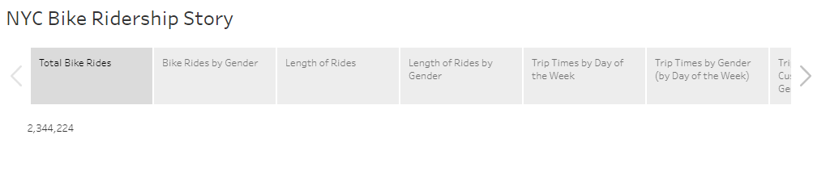
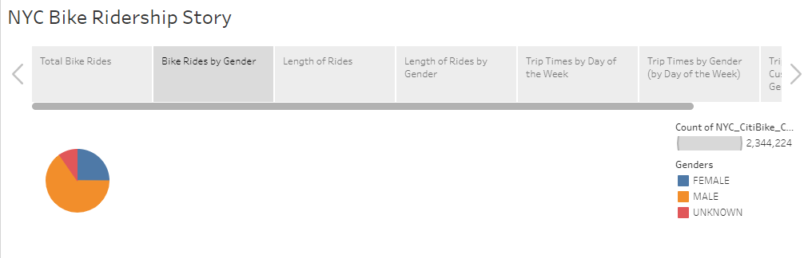
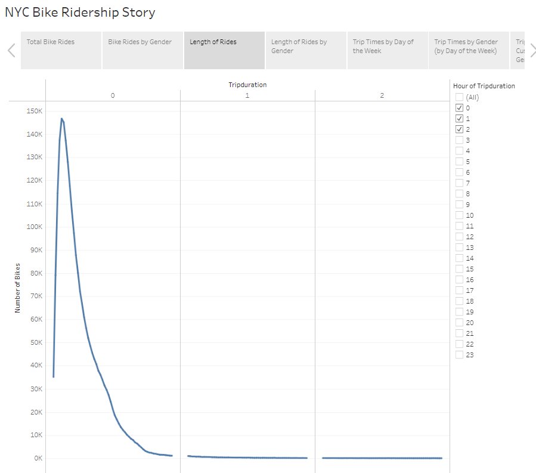
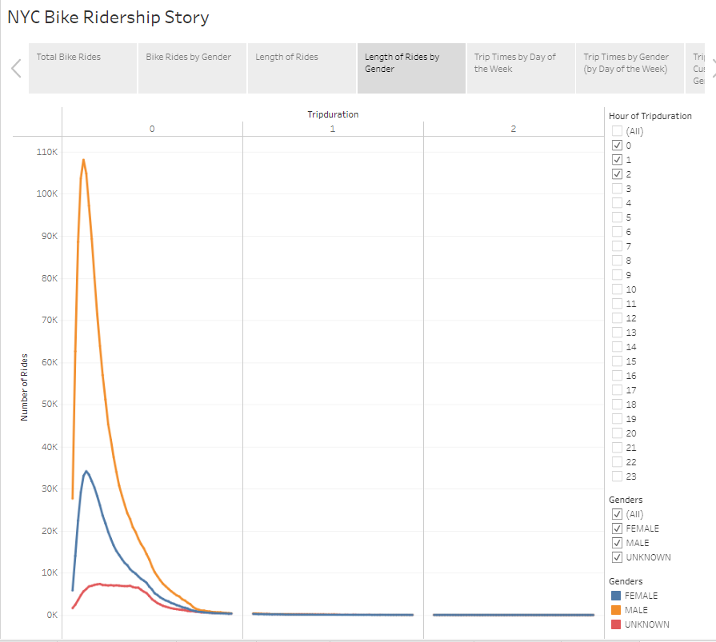
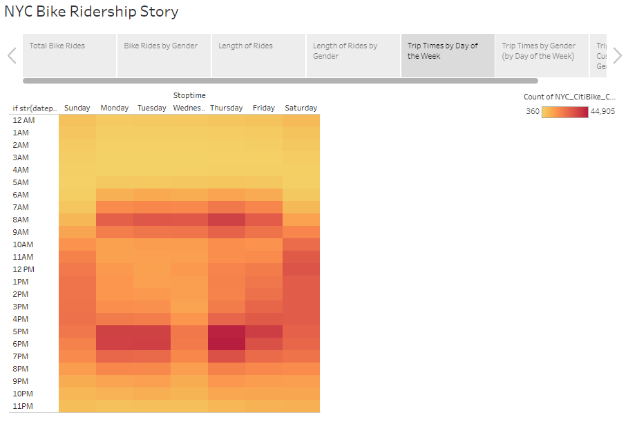
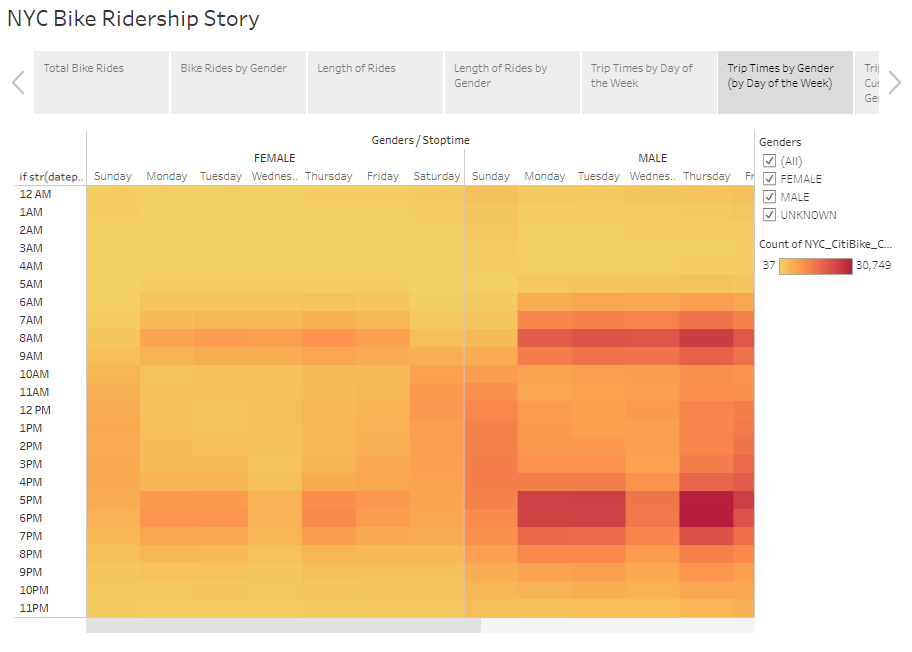
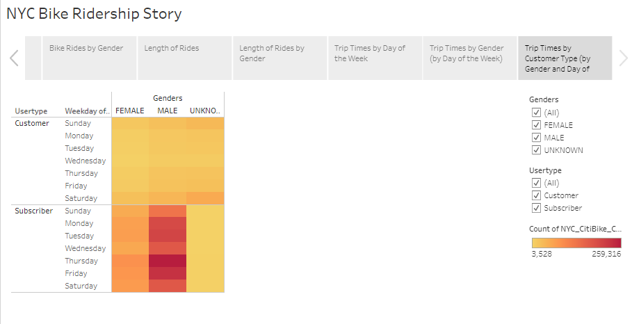

# Analysis of NYC Bikeshare Program Usage
Module 14 challenge

## Overview
Analysis was completed of the bikeshare program in New York City on behalf of client (potential bikeshare business in city of Des Moines) in order to make a case for a similar program in the city of Des Moines. Client requests data on customer types, peak usage times, and any other pertinent ridership information that may help determine program viability.

## Results

### Total Rides
A review of NYC Bikeshare ridership from August of 2019 shows a total of 2,344,244 bike rides completed.

While this level of ridership is certainly unique to the population density of NYC, there are still pieces ridership data that can be analyzed for patterns that may translate to Des Moines.

### Rider Gender
A breakdown of ridership by gender shows that a significant majority of these rides (more than 1.5 million) were completed by males. Females riders completed approximately 25% of the rides, and the remaining rider genders were unknown. 

Although the level of unknown-gender riders is fairly high for a detailed analysis, it can still be stated with certainty that most riders are male.

### Ride Length
A breakdown of bike rides by ride length in minutes shows another significant piece of data. Bike rides are approximately 5 minutes long, with a range of 2 to 13 minutes containing the lion's share of rides. 

Outlier rides exist, but for the purposes of focusing on profitable market shares, this time frame is crucial.

### Ride Lengths by Gender
Breaking ride length down by gender shows that the trend remains true for both females and males, albeit with a much more significant increase at the 5 minute mark for male riders.

### Trip Times by Day of Week
A heat map examining ridership time by the day of the week shows a very clear pattern.

While weekend ridership seems to be fairly even during the more pleasant hours of the day, weekday ridership has distinct peaks during what would be considered "commute" times.

### Weekday Trip Times by Gender
Splitting the heat map from above out to reflect each gender shows a similar pattern for both males and females, albeit more distinct for males.

### Trip Times by Customer Type, Gender, and Day of the Week
In the heat map below, ridership is split between those who are "subscribers" and those who are "customers". 

The split shows that the majority of male ridership is concentrated in the "subscriber" category, and that subscribers ride least on Wednesdays, regardless of gender. It also shows that, among "customers", ridership seems to be slightly increased on the weekends (Saturdays and Sundays).

## Summary 
Overall, several things become clear when examining the data above. The most desirable target demographic for profitable ridership will be male commuters willing to purchase a subscription to the service and able to commute to work by bike in no more than 15 minutes. 

Moving forward, it is recommended that the customer gather a few pieces of data on the targeted city and methods of work commute, as well as the financial model of the bikeshare program. Is more profit being made in the NYC program through subscribers who seem to use on the weekdays, or through customers on the weekends? Are there enough potential commuters in Des Moines who live within a 15 minute bike ride of their workplace? Does a similar pattern hold in NYC in colder months?

https://public.tableau.com/app/profile/brenda.johansen/viz/Bikesharing_16605309617000/NYCBikeRidershipStory

